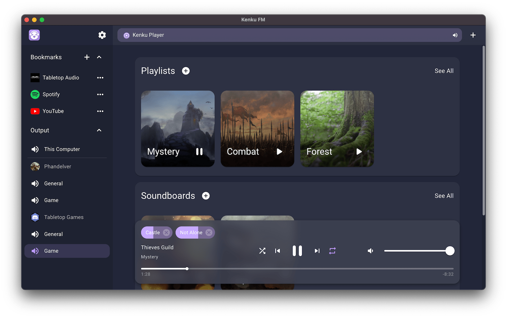

# Kenku FM

Kenku FM is a desktop application for Windows, MacOS and Linux designed to be the easiest way to share music in a Discord voice call.

- Use the Kenku Player interface to share your **local music** and sound effects to your discord calls.
- Use the built in web browser to share audio from your favourite websites like **YouTube** and **Spotify**.
- Trigger and control sounds with the Kenku FM plugin for the **Elgato Stream Deck**.
- If you already have a **virtual audio cable** setup use Kenku FM as an easy way to connect to Discord with your existing software.

  

## Installing

Prebuilt binaries can be found at [kenku.fm](https://www.kenku.fm) or from the [GitHub releases](https://github.com/owlbear-rodeo/kenku-fm/releases).

## Docs

Docs on using Kenku FM can be found [here](https://www.kenku.fm/docs).

## How it Works

1. Kenku FM is an [Electron](https://www.electronjs.org/) application primarily written in [Typescript](https://www.typescriptlang.org/) and [React](https://reactjs.org/).
2. Electron browser views are used to display external web content or the built in audio player app.
3. The user creates and provides their own Discord bot token to connect to Discord.
4. The Electron media capture API is used to capture audio from each browser view. The audio is then mixed using a Web Audio Context and sent to a Severus.
5. Severus is an audio server written in Rust that sits along side Kenku FM. It receives an incoming RTC connection and broadcasts it to multiple Discord servers.
6. An optional HTTP server allows users to trigger and control the playback of the built in player app. An example of this in action can be seen with our [Stream Deck plugin](https://www.kenku.fm/docs/using-kenku-remote).
7. Enable external inputs to allow mixing in OS audio inputs.
8. Enable multiple outputs to send your audio to multiple Discord servers at once.
9. If you plan to use Kenku FM for streaming you can also output to your local machine for capture by a streaming app and a discord call for your players at the same time.

## Building

Kenku FM uses [Yarn](https://yarnpkg.com/) as a package manager and [Electron Forge](https://www.electronforge.io/) as an Electron builder.

You will need NodeJS installed as well as Rust.

To install all the dependencies run `yarn` in both the base folder and severus folder.

To run Kenku FM in a development mode run:

`yarn start`

To make a production build run:

`yarn make`

If you wish to add protected media playback support follow the build steps from the [Electron for Content Security](https://github.com/castlabs/electron-releases) repo.

## Stream Deck

The stream deck plugin can be found [here](https://github.com/owlbear-rodeo/kenku-fm-stream-deck).

## Protected Media

As we act as a web browser in order to play protected media we need to support Google's Widevine [Content Decryption Module (CDM)](https://www.widevine.com/). To do this Kenku FM uses the [Electron for Content Security](https://github.com/castlabs/electron-releases) version of Electron provided by Castlabs.

This allows us to support loading of DRM protected media on Windows and MacOS.

Unfortunately the story isn't as simple on Linux. While we are able to provide support for protected media on x64 Linux builds, Linux doesn't support the Widevine Verified Media Path (VMP) this means that sites that require the use of VMP will not work. Unfortunately at this time Spotify requires VMP. You can read more about VMP and Linux [here](https://arstechnica.com/gadgets/2020/08/hbo-max-cranks-up-the-widevine-drm-leaves-linux-users-in-the-cold/).

Next Google doesn't provide a publicly available ARM Linux version of their Widevine Content Delivery Module so we are unable to provide any protected media support on ARM Linux.

If any of these change we'll be happy to update Kenku FM with full support for protected media on Linux.

## Project Structure

All source files can be found in the `src` folder, our build scripts for CI/CD are in the `publish` folder.

Within the `src` folder the `index.ts` file and `main` folder contains the code for the main process of Electron. This includes things like managing the Severus connection, creating the HTTP server for the remote control and managing the browser views.

The `renderer.ts` file and `renderer` folder contains code for the renderer process of Electron. The renderer is written in React and uses Redux Toolkit for state management.

The `preload.ts` file and `preload` folder contains code for the preload script for the renderer. The preload script mainly acts as a bridge to expose functionality from the main process to the renderer.

The `player` folder contains the code for the built in audio player. This runs as a separate web view and is loaded as a separate entry point in the `forge.config.js`. The player app is written in React and also uses Redux Toolkit for state management.

The `audioCapture` folder contains the code used for mixing and capturing browser tabs. It also creates the RTC connection to Severus.

The `severus` folder contains the Rust project for the audio server.

## Licence

Kenku FM is licensed under the GNU General Public Licence v3.0.

## Contributing

For our own wellbeing Kenku FM follows a similar contribution policy projects like [Litestream](https://github.com/benbjohnson/litestream#open-source-not-open-contribution).

This means we are open to pull requests for bug fixes only. Pull requests for new features will not be accepted due to the burden of maintaining these features into the future.
