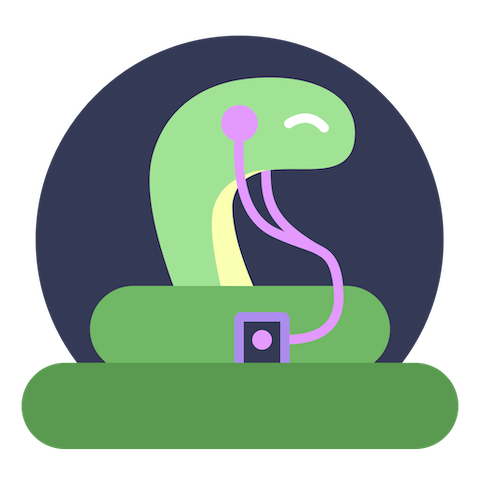

# severus



## Installing severus

Installing severus requires a [supported version of Node and Rust](https://github.com/neon-bindings/neon#platform-support).

You can install the project with yarn. In the project directory, run:

```sh
$ yarn
```

This fully installs the project, including installing any dependencies and running the build.

## Building severus

If you have already installed the project and only want to run the build, run:

```sh
$ yarn build
```

This command uses the [cargo-cp-artifact](https://github.com/neon-bindings/cargo-cp-artifact) utility to run the Rust build and copy the built library into `./index.node`.
